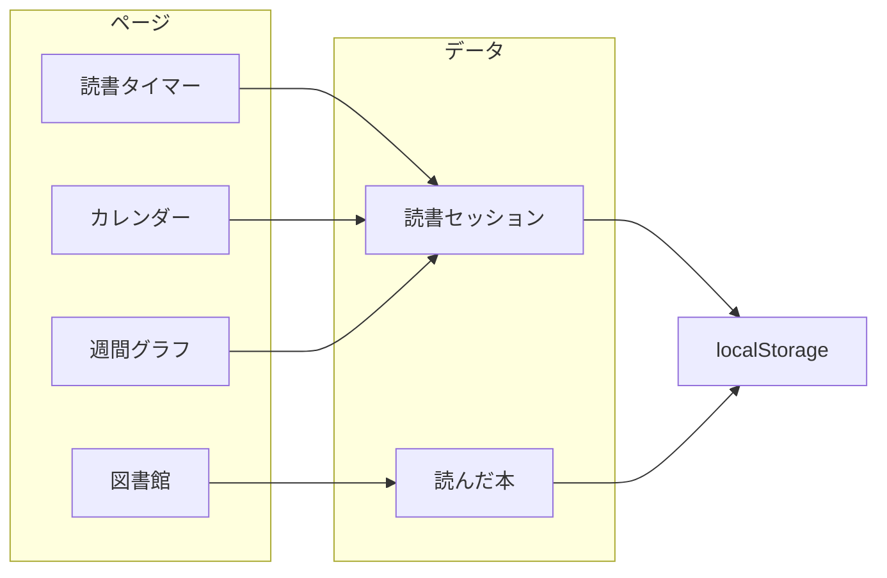

# 読書記録アプリ実装計画

## 現状

- [package.json](package.json): Create React App + React 19、JavaScript
- [src/App.js](src/App.js): デフォルトテンプレートのみ（読書記録機能なし）

## アーキテクチャ概要



- **データ永続化**: ブラウザの `localStorage`（バックエンドなしで完結）
- **ルーティング**: `react-router-dom` で「読書時間」「図書館」などのタブ/ページ切り替え
- **グラフ**: `recharts` で直近1週間の読書時間を折れ線グラフ表示
- **日付処理**: `date-fns` で日付フォーマット・週計算（軽量で十分）

---

## 1. 依存関係の追加

- `react-router-dom`: 画面切り替え（読書時間 / 図書館）
- `recharts`: 折れ線グラフ
- `date-fns`: 日付のフォーマット・「今日」「直近7日」の計算

---

## 2. データ構造とストレージ

**読書セッション（読書時間の記録）**

- `id`, `date`（日付 YYYY-MM-DD）, `minutes`（読書分数）, 任意で `startedAt`/`endedAt`（タイマー用）
- 配列を `localStorage` のキー例: `reading_sessions` に JSON で保存

**読んだ本（図書館）**

- `id`, `title`, `author`, `summary`（概要）, 任意で `createdAt`
- 配列を `localStorage` のキー例: `reading_books` に JSON で保存

共通の読み書き用ヘルパー（例: `src/utils/storage.js`）を用意し、各画面から利用する。

---

## 3. 読書時間の記録機能

### 3.1 タイマー

- 開始 / 停止ボタンで経過時間を計測（`setInterval` または `Date` の差分）
- 停止時に「今日」の日付でセッションを保存（分数で `minutes` を追加）
- 既存の「今日」のセッションがあれば分数を加算するか、セッションを追加するかは仕様で決定（例: 1日複数セッションとして複数レコードでOK）

配置案: `src/components/Timer.js`、`src/pages/ReadingTimePage.js` でタイマー＋カレンダー＋グラフをまとめて表示するか、サブタブで切り替え。

### 3.2 カレンダー

- 月表示のカレンダーで、日付ごとにその日の合計読書時間（分数 or 時間）を表示
- `reading_sessions` を `date` で集計して表示
- カレンダーUI: 軽量に `date-fns` で月のグリッドを組み、各セルに合計時間を表示（外部ライブラリ `react-calendar` 等を使っても可）

配置案: `src/components/ReadingCalendar.js`

### 3.3 直近1週間の折れ線グラフ

- `reading_sessions` から直近7日分を取得し、日付を X 軸、合計読書時間（分 or 時間）を Y 軸にした折れ線グラフ
- `recharts` の `LineChart`, `Line`, `XAxis`, `YAxis`, `Tooltip`, `ResponsiveContainer` を使用
- データが無い日は 0 分として表示すると見やすい

配置案: `src/components/WeeklyReadingChart.js`

---

## 4. 読んだ本の情報をまとめる（図書館）

- 一覧: 登録した本をリスト表示（タイトル・著者・概要の抜粋）
- 追加: フォームでタイトル・著者・概要を入力して保存
- 詳細/編集: クリックで詳細表示し、編集・削除できるようにする

配置案: `src/pages/LibraryPage.js`、`src/components/BookList.js`、`src/components/BookForm.js`（追加/編集兼用）、`src/components/BookDetail.js`（任意）

---

## 5. 画面構成とルーティング

- **/**: リダイレクトまたはダッシュボード
- **/reading**: 読書時間（タイマー + カレンダー + 週間グラフを同一ページに配置、またはタブで切り替え）
- **/library**: 図書館（一覧・追加・詳細/編集）

共通レイアウト: ヘッダーまたはナビで「読書時間」「図書館」へのリンクを表示。[App.js](src/App.js) で `BrowserRouter` と `Routes` を設定し、上記パスを割り当てる。

---

## 6. ファイル構成案

```
src/
  App.js                 # Router, 共通レイアウト, Routes
  index.js
  index.css
  utils/
    storage.js           # localStorage の読書セッション・本の読み書き
  pages/
    ReadingTimePage.js   # タイマー + カレンダー + 週間グラフ
    LibraryPage.js       # 図書館一覧・追加フォーム
  components/
    Timer.js             # 読書タイマー
    ReadingCalendar.js   # 日別読書時間カレンダー
    WeeklyReadingChart.js # 直近1週間の折れ線グラフ
    BookList.js          # 本一覧
    BookForm.js          # 本の追加/編集フォーム
    Layout.js            # ヘッダー・ナビ・children（任意）
```

---

## 7. UI・スタイル

- 既存の [App.css](src/App.css) / [index.css](src/index.css) をベースに、必要に応じてコンポーネント用の CSS や CSS Modules を追加
- 折れ線グラフは recharts のデフォルトスタイルのままでも可。カレンダー・タイマー・図書館リストはシンプルなフォームとカードで統一すると実装が早い

---

## 8. 実装順序の提案

1. `storage.js` とデータ構造の定義・読み書き
2. ルーティングと共通レイアウト（App.js + Layout）
3. タイマー → 停止時にセッション保存
4. カレンダー（セッションの日別集計表示）
5. 週間折れ線グラフ（recharts）
6. 図書館: 一覧 → 追加フォーム → 詳細/編集・削除

---

## 確認したい点（オプション）

- **データ永続化**: まずは localStorage で進めて問題ないか（将来バックエンドを足す場合は API 層を後から差し替え可能）
- **言語**: 現状の JavaScript のまま進めるか、TypeScript に移行してから実装するか

この計画で進めてよければ、上記順序で実装に落とし込めます。
